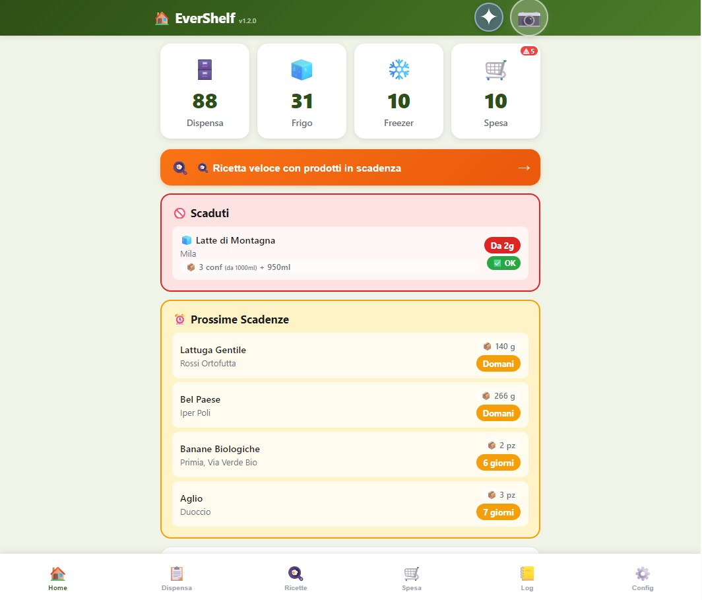
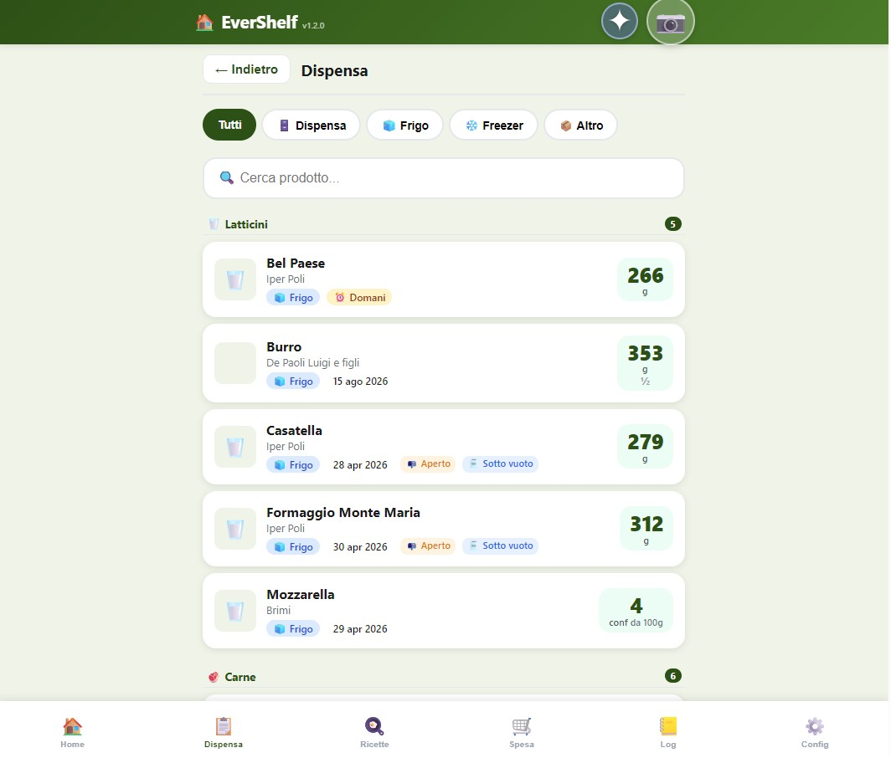
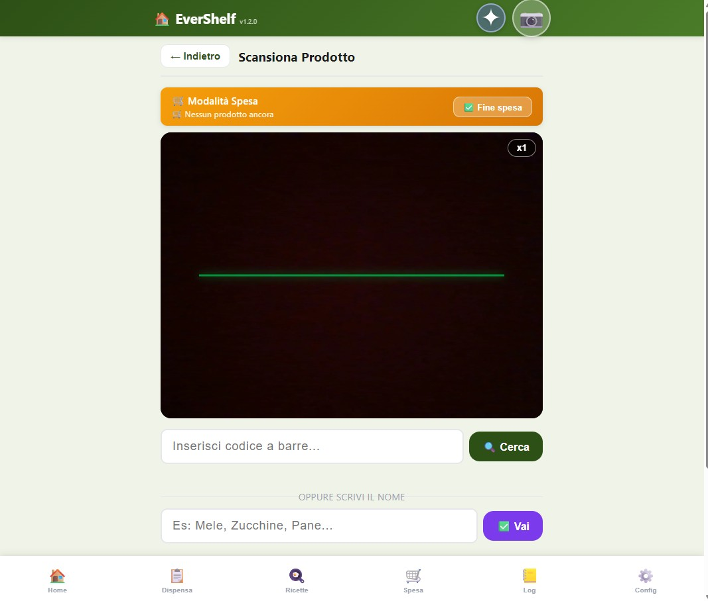
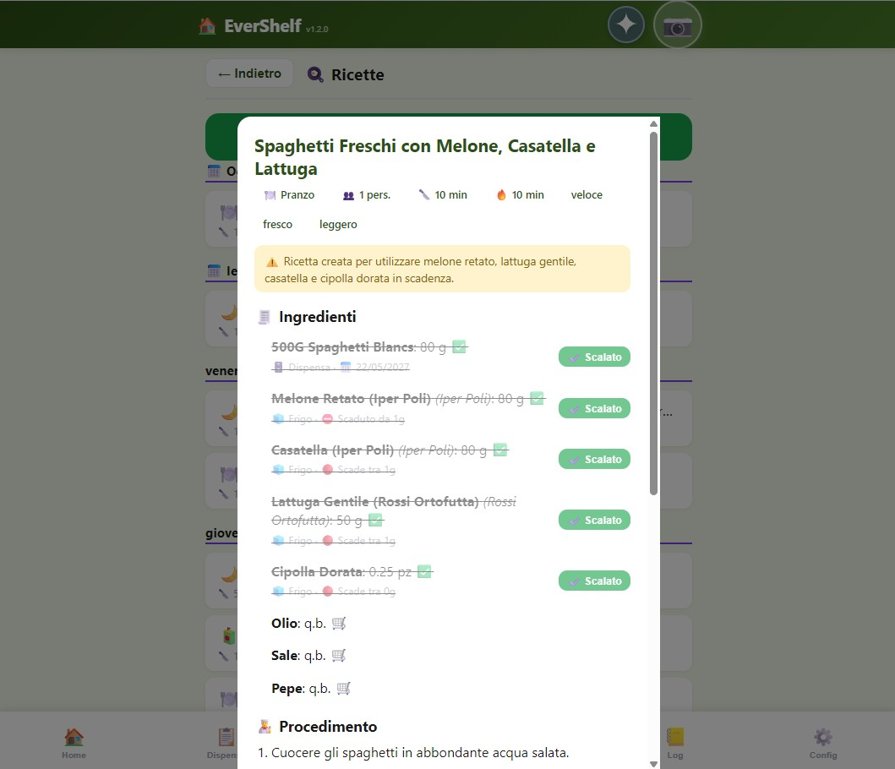
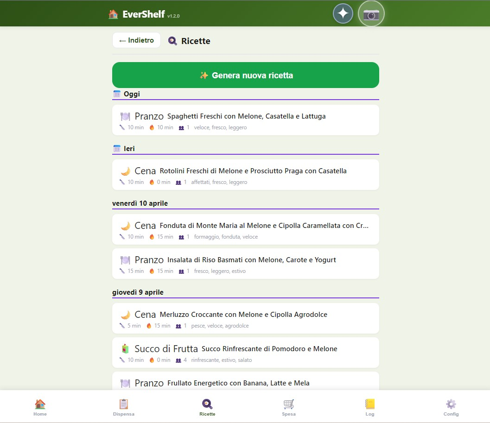
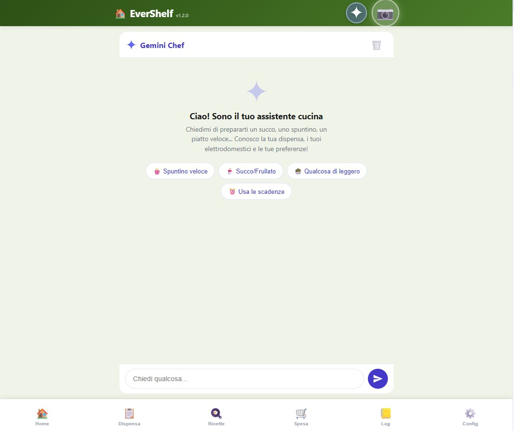
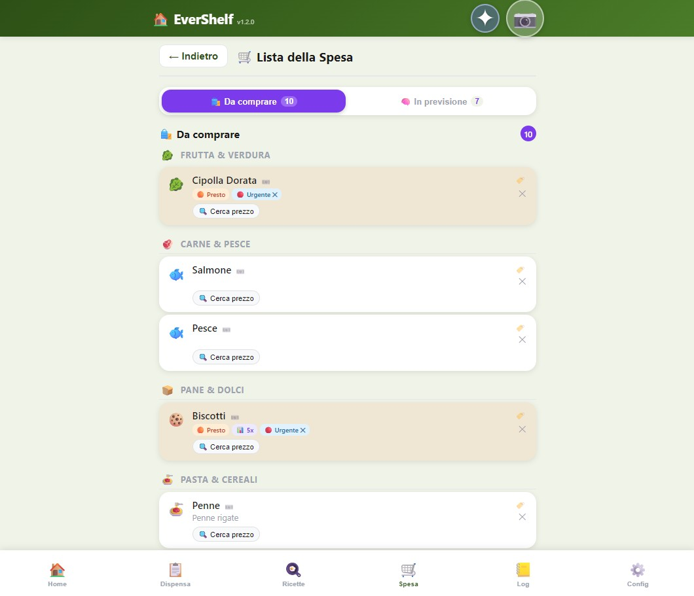
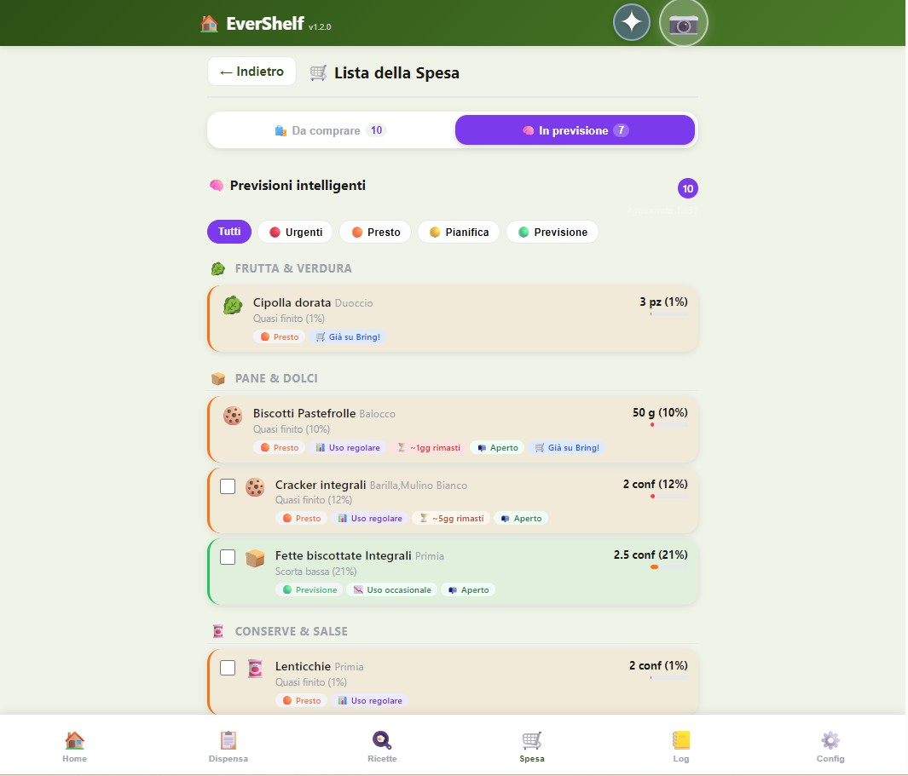

# 🏠 EverShelf

> **Self-hosted pantry management system** — Track your food inventory, scan barcodes, get AI-powered recipe suggestions, and reduce waste.

🌐 **Website:** [evershelfproject.dadaloop.it](https://evershelfproject.dadaloop.it/)

[](LICENSE)
[](https://www.php.net/)
[](https://www.sqlite.org/)
[](Dockerfile)
[](translations/)

---

## 🌍 Recent i18n Updates

- Recipe and meal-plan labels now resolve at runtime from translations, preventing raw placeholders like `meal_types.*` and `meal_plan_types.*` from appearing in the UI.
- Recipe generation now receives the selected app language (`it`/`en`/`de`) and enforces localized output in both streaming and non-streaming API flows.
- Added missing shared error keys (`error.network`, `error.no_api_key`) across all language files to keep fallback/error toasts fully translated.

## ✨ Features

### 📦 Inventory Management
- **Barcode scanning** — Scan products with your phone camera using QuaggaJS
- **AI identification** — Take a photo and let Google Gemini identify the product, with suggestions from your existing inventory; gracefully shows a friendly message when AI quota is exhausted instead of a raw API error
- **Smart locations** — Track items across Pantry, Fridge, Freezer, and custom locations
- **Expiry tracking** — Automatic shelf-life estimation based on product type and storage
- **Opened product tracking** — Reduced shelf-life calculation when packages are opened; opened-product expiry is now also checked when building banner alerts (not just the dashboard section)
- **Vacuum-sealed support** — Extended expiry dates for vacuum-sealed items
- **Anomaly detection** — Banner alerts for suspicious quantities and consumption predictions with inline correction; dismiss button now shows the current inventory quantity so the action is unambiguous ("La quantità è giusta (2 pz)")

### 🤖 AI-Powered (Google Gemini)
- **Expiry date reading** — Photograph a label and extract the expiry date automatically
- **Product identification** — Point your camera at any product for instant recognition
- **Existing product matching** — AI scan shows matching products already in your pantry before suggesting new ones
- **Recipe generation** — Get personalized recipes based on what's in your pantry; streams live via Server-Sent Events so results appear as they are generated
- **Smart chat assistant** — Ask questions about your inventory, get cooking tips
- **Shopping suggestions** — AI-powered purchase recommendations
- **Model fallback** — All AI endpoints try `gemini-2.5-flash` first (separate quota) and fall back to `gemini-2.0-flash` automatically, matching the resilience already used for recipe generation

### 🛒 Shopping List
- **Bring! integration** — Sync with the [Bring!](https://www.getbring.com/) shopping list app
- **Generic shopping names** — Products are grouped by type ("Latte", "Affettato", "Panna da cucina") rather than brand, keeping the Bring! list clean and consolidated
- **Smart predictions** — Know what you'll need before you run out
- **Auto-add on depletion** — When a product reaches zero the app adds it to Bring! automatically, no confirmation needed
- **Auto-remove on scan** — Products are removed from the shopping list when scanned in  - **Auto-migration** — Items already on the Bring! list are silently renamed to their generic name in the background (throttled, runs on list load)
  - **Catalog coverage** — All product types resolve to a German Bring! catalog key for icon and category display in the Bring! app- **DupliClick integration** — Online grocery ordering (Gruppo Poli)

### 🍳 Cooking Mode
- **Step-by-step guidance** — Follow recipes with a hands-free cooking interface
- **Text-to-Speech** — Voice readout of recipe steps; supports browser Web Speech API, native Android TTS (kiosk), or a custom REST endpoint (Home Assistant, etc.); retries voice loading for up to 10 seconds with a fallback refresh button; TTS activates automatically without requiring the global TTS setting to be enabled
- **Auto-read on navigate** — Each step is read aloud automatically when you tap Next or Previous; the first step is read when entering cooking mode
- **Timer voice alerts** — 10-second countdown warning spoken aloud before each timer expires; expiry announced vocally when time is up
- **Recipe completion** — "Buon appetito!" spoken when the last step is confirmed
- **Built-in timer** — Automatic timer suggestions based on recipe instructions
- **Ingredient tracking** — Mark ingredients as used during cooking; leftover quantities prompt a "move to another location" flow

### 📊 Dashboard
- **Waste tracking** — Monitor consumed vs. wasted products over 30 days
- **Expiry alerts** — Visual warnings for expired and soon-to-expire items
- **Safety ratings** — Smart assessment of expired product safety (by category and location); expired unsafe items shown with a red danger banner and "L'ho buttato" as the primary action
- **Expired product banner** — Products that have passed their effective shelf-life (including opened-product reduced expiry) appear in the top notification banner with safety tip, danger styling for high-risk items, and a prominent discard action
- **Quick recipe bar** — One-tap recipe suggestion using expiring products
- **Anomaly banner** — Scrollable banner with suspicious quantities and consumption prediction mismatches, with one-tap correction or inline edit
- **Expired/expiring alerts** — Priority-sorted banner notifications for expired and soon-to-expire products with use, throw, edit, and dismiss actions
- **Swipe navigation** — Touch swipe or tap arrows/dots to browse banner notifications
- **Quick-access buttons** — Recently used and most popular products shown on the inventory page for fast access

### 📱 Progressive Web App
- **Mobile-first design** — Optimized for phones, works on tablets and desktop
- **Installable** — Add to home screen for a native app experience
- **Multi-device** — Settings and data sync across devices on the same server

### ⚖️ Smart Scale Integration (Add-on)
- **Bluetooth gateway** — Connects a BLE smart scale to EverShelf via local WebSocket
- **SSE relay** — Server-side relay avoids mixed-content (HTTPS→WS) issues
- **Auto-discovery** — Server scans LAN to find the gateway automatically
- **Auto weight reading** — When adding/using a product with unit g/ml, weight fills automatically
- **10g threshold** — Ignores readings that haven't changed enough between products  - **Duplicate-reading prevention** — Server-side 12-second dedup window rejects a second scale-triggered deduction of the same product, guarding against BLE multi-fire- **ml conversion hint** — Shows "weight in grams → will be converted to ml" when product unit is ml
- **Stability + auto-confirm** — 10s stable wait + 5s countdown before confirming
- **Real-time status** — Scale connection indicator always visible in the header
- **Multi-protocol** — Supports Bluetooth SIG Weight Scale, Body Composition, Xiaomi Mi Scale 2 and 100+ models
- **Android gateway app** — [`evershelf-scale-gateway/`](evershelf-scale-gateway/) — open-source, downloadable APK

### 📺 Android Kiosk Mode (Add-on)
- **Dedicated tablet app** — Full-screen WebView wrapper for wall-mounted kitchen tablets
- **True kiosk lock** — Screen pinning blocks home/recent buttons
- **Setup wizard** — 3-step guided configuration (URL, connection test, gateway)
- **Gateway auto-launch** — Launches the Scale Gateway in the background on startup
- **Camera & mic permissions** — Full hardware access for barcode scanning and voice
- **Native TTS bridge** — Cooking mode voice readout uses the Android TextToSpeech engine directly, bypassing Web Speech API voice limitations; no offline voice packs required
- **Hard refresh** — ↻ button clears WebView cache to pick up web app updates
- **Update notifications** — Checks GitHub releases every 6h, shows banner when updates available
- **SSL support** — Accepts self-signed certificates
- **Android kiosk app** — [`evershelf-kiosk/`](evershelf-kiosk/) — downloadable APK

---

## 🚀 Quick Start

### Prerequisites
- **Web server** with PHP 8.0+ (Apache or Nginx)
- **PHP extensions**: `pdo_sqlite`, `curl`, `mbstring`, `json`
- **HTTPS** recommended (required for camera access on mobile)

### Installation

#### Option A: Docker (recommended)

```bash
# 1. Clone the repository
git clone https://github.com/dadaloop82/EverShelf.git
cd EverShelf

# 2. Create configuration file
cp .env.example .env
nano .env

# 3. Start with Docker Compose
docker compose up -d

# → Open http://localhost:8080
```

#### Option B: Manual

```bash
# 1. Clone the repository
git clone https://github.com/dadaloop82/EverShelf.git
cd EverShelf

# 2. Create configuration file
cp .env.example .env

# 3. Set permissions
chmod 755 data/
chmod 664 data/.gitkeep
chown -R www-data:www-data data/

# 4. Edit your configuration
nano .env
```

### Configuration (.env)

```ini
# Required for AI features (get a key at https://aistudio.google.com/app/apikey)
GEMINI_API_KEY=your_api_key_here

# Optional: Bring! shopping list integration
BRING_EMAIL=your_email@example.com
BRING_PASSWORD=your_password

# Optional: Text-to-Speech for cooking mode
TTS_URL=http://your-home-assistant:8123/api/events/tts_speak
TTS_TOKEN=your_long_lived_token
TTS_ENABLED=true
```

### Web Server Configuration

<details>
<summary><strong>Apache (.htaccess)</strong></summary>

The app works out of the box with Apache if placed in the web root or a subdirectory. Make sure `mod_rewrite` is enabled and `AllowOverride All` is set.

```apache
<Directory /var/www/html/evershelf>
    AllowOverride All
    Require all granted
</Directory>
```

</details>

<details>
<summary><strong>Nginx</strong></summary>

```nginx
server {
    listen 80;
    server_name your-server.local;
    root /var/www/html/evershelf;
    index index.html;

    location /api/ {
        try_files $uri $uri/ =404;
        location ~ \.php$ {
            fastcgi_pass unix:/run/php/php8.2-fpm.sock;
            fastcgi_param SCRIPT_FILENAME $document_root$fastcgi_script_name;
            include fastcgi_params;
        }
    }

    # Deny access to sensitive files
    location ~ /\.env { deny all; }
    location ~ /data/ { deny all; }
    location ~ /backup\.sh { deny all; }
}
```

</details>

### HTTPS Setup (Recommended)

Camera access requires HTTPS on most mobile browsers. Options:
- **Let's Encrypt** with Certbot (for public-facing servers)
- **Self-signed certificate** (for local network only)
- **Reverse proxy** (e.g., Caddy, Traefik) with automatic TLS

### Cron Job (Optional)

Set up a cron job for smart shopping predictions:

```bash
# Run every 5 minutes
*/5 * * * * php /path/to/evershelf/api/cron_smart_shopping.php >> /path/to/evershelf/data/cron.log 2>&1
```

### Backup (Optional)

The included `backup.sh` creates local daily backups of your database:

```bash
# Run daily at 3 AM
0 3 * * * /path/to/evershelf/backup.sh
```

---

## 🏗️ Architecture

```
evershelf/
├── index.html              # Single-page application (SPA)
├── manifest.json           # PWA manifest
├── .env.example            # Configuration template
├── backup.sh               # Local database backup script
├── LICENSE                 # MIT License
│
├── api/
│   ├── index.php           # Main API router (all endpoints)
│   ├── database.php        # SQLite schema, migrations, helpers
│   └── cron_smart_shopping.php  # Background job for predictions
│
├── assets/
│   ├── css/style.css       # All application styles
│   ├── js/app.js           # All application logic
│   └── img/                # Static images
│
└── data/                   # Runtime data (gitignored)
    ├── evershelf.db         # SQLite database (auto-created)
    ├── backups/            # Local DB backups
    └── *.json              # Token/cache files

evershelf-scale-gateway/    # ⚖️ Android BLE gateway (add-on)
    ├── README.md           # Setup & protocol docs
    └── app/src/            # Kotlin Android source (WebSocket + BLE)

evershelf-kiosk/            # 📺 Android kiosk app (add-on)
    ├── README.md           # Setup & feature docs
    └── app/src/            # Kotlin Android source (WebView wrapper)
```

### API Endpoints

| Category | Action | Method | Description |
|----------|--------|--------|-------------|
| **Products** | `search_barcode` | GET | Find product by barcode |
| | `lookup_barcode` | GET | Look up barcode on Open Food Facts |
| | `product_save` | POST | Create or update a product |
| | `products_list` | GET | List all products |
| **Inventory** | `inventory_list` | GET | List inventory items |
| | `inventory_add` | POST | Add product to inventory |
| | `inventory_use` | POST | Use/consume from inventory |
| | `inventory_summary` | GET | Count by location |
| **AI** | `gemini_identify` | POST | Identify product from photo |
| | `gemini_expiry` | POST | Read expiry date from photo |
| | `gemini_chat` | POST | Chat with AI assistant |
| | `generate_recipe` | POST | Generate recipe from inventory |
| **Shopping** | `bring_list` | GET | Get Bring! shopping list |
| | `bring_add` | POST | Add items to Bring! |
| | `smart_shopping` | GET | Smart shopping predictions |
| **Settings** | `get_settings` | GET | Get server configuration |
| | `save_settings` | POST | Update server configuration |

---

## 🔒 Security Notes

- **Credentials** are stored in `.env` (server-side, never committed to Git)
- **Database** stays local — never pushed to remote repositories
- **API keys** are passed server-side only — never exposed to the browser
- The API uses **parameterized SQL queries** (PDO prepared statements) against injection
- **Input validation** on all inventory operations (quantity bounds, location whitelist)
- Consider adding **authentication** if the server is accessible from the internet

---

## 🛠️ Development

```bash
# Run PHP's built-in server for local development
php -S localhost:8080 -t /path/to/evershelf

# Check PHP syntax
php -l api/index.php
php -l api/database.php
```

The application uses no build tools — edit files directly and refresh.

---

## 📋 Roadmap

- [x] Multi-language support (i18n) — 3 languages (it/en/de), 347 keys
- [ ] User authentication / multi-user support
- [x] Docker container for easy deployment — see [Dockerfile](Dockerfile) + [docker-compose.yml](docker-compose.yml)
- [x] REST API documentation (OpenAPI/Swagger) — see [docs/openapi.yaml](docs/openapi.yaml)
- [x] First-run setup wizard — 4-step guided configuration
- [x] API rate limiting — file-based, 3 tiers (120/15/5 req/min)
- [x] CI/CD pipeline — GitHub Actions (lint, Docker build, translation validation)
- [x] Android kiosk mode — dedicated tablet app with screen pinning
- [x] Anomaly detection banner — suspicious quantities + consumption predictions
- [x] AI scan local matching — suggest existing pantry products before OFF lookup
- [x] Scale auto-fill improvements — 10g threshold, ml conversion hints
- [x] Update notification system — kiosk checks GitHub releases
- [x] Generic shopping name grouping — compound-phrase + keyword map (100+ entries) + Gemini AI fallback
- [x] Auto-add to Bring! on product depletion — no confirmation step when stock reaches zero
- [x] Native Android TTS in kiosk — bypasses Web Speech API voice detection issues
- [ ] Offline mode with service worker
- [ ] Export/import inventory data
- [ ] Notification system (Telegram, email) for expiring products

---

## 🌐 Translations

The app supports multiple languages via JSON translation files in the `translations/` folder.

| Language | Status |
|----------|--------|
| 🇮🇹 Italian (it) | ✅ Complete (base) |
| 🇬🇧 English (en) | ✅ Complete |
| 🇩🇪 German (de) | ✅ Complete |

**Want to add your language?** See the [Translation Guide](CONTRIBUTING.md#-adding-translations) — just copy `translations/it.json`, translate the values, and submit a PR!

---

## 🤝 Contributing

Contributions are welcome! See [CONTRIBUTING.md](CONTRIBUTING.md) for detailed guidelines.

1. Fork the repository
2. Create a feature branch (`git checkout -b feature/my-feature`)
3. Commit your changes (`git commit -m 'Add my feature'`)
4. Push to the branch (`git push origin feature/my-feature`)
5. Open a Pull Request

---

## 📄 License

This project is licensed under the **MIT License** — see the [LICENSE](LICENSE) file for details.

---

## 👨‍💻 Author

**Stimpfl Daniel** — [evershelfproject@gmail.com](mailto:evershelfproject@gmail.com)

- Website: [evershelfproject.dadaloop.it](https://evershelfproject.dadaloop.it/)
- GitHub: [@dadaloop82](https://github.com/dadaloop82)

---

## 📸 Screenshots

| | | |
|:---:|:---:|:---:|
|  |  |  |
| **Dashboard** — Inventory overview with counters by location (pantry, fridge, freezer), upcoming expiry alerts, and consumed vs. wasted tracking over the last 30 days. | **Inventory** — Full product list filterable by location (All / Pantry / Fridge / Freezer) and searchable by name, with category, quantity, and expiry date. | **Barcode Scanner** — Scan barcodes with the camera (QuaggaJS) or enter manually. Shopping mode lets you register purchased products in quick sequence. |
|  |  |  |
| **AI Recipe Detail** — Recipe generated by Gemini AI using expiring ingredients: each ingredient is matched to the real inventory with quantity and location, ready to scale. | **Recipes** — History of AI-generated recipes, organized by day and meal (lunch / dinner / other), with preparation and cooking time. | **Cooking Mode** — Fullscreen step-by-step guide with Text-to-Speech. Each step shows the ingredient to use from your pantry with an integrated "Use" button. |
|  |  |  |
| **Gemini Chat** — AI assistant that knows your pantry, your appliances, and your preferences. Suggests snacks, smoothies, or quick meals with a single tap. | **Shopping List** — List synced with Bring!, organized by product category, with urgency indicators and links to search for prices online. | **Smart Predictions** — AI analysis of historical consumption: shows what is running low, how much time is left, and why restocking is recommended (regular use, nearly empty, opened). |
